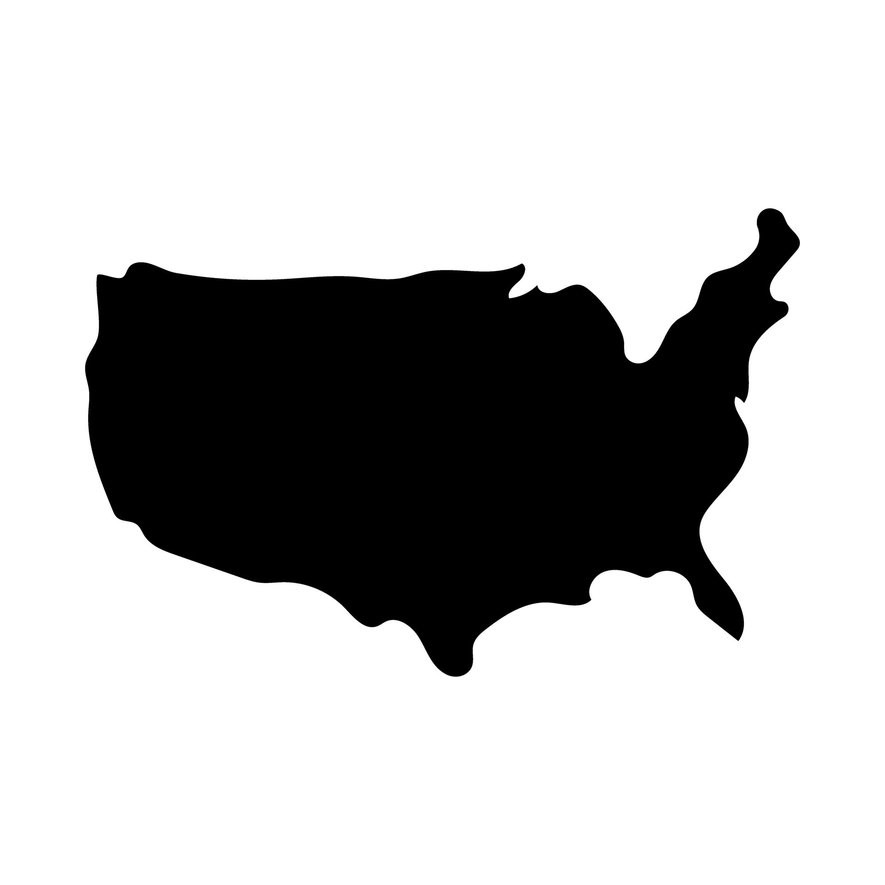

# USA Map Injection Mold
This project presents the creation of an injection mold part featuring a "God Bless America" engraving on a USA map silhouette. Starting from a hand-drawn image, the design was processed in MATLAB to extract vector outlines and convert them into DXF format, which was then used for CAD modeling and mold design.

It includes:
- Image vectorization and conversion to DXF format using MATLAB
- SolidWorks part design based on DXF profiles
- Toolpath generation and G-code creation for CNC manufacturing
- Setup sheet documentation for the CNC process

## Author
Serge Alhalbi

## Company
The Ohio State University

## Collaborators
- Neil Gardner

## Tools and Libraries
- SolidWorks
- CNC
- MATLAB

## Usage
```bash
git clone https://github.com/SergeAlhalbi/usa-map-injection-mold.git
cd usa-map-injection-mold
```

## Results
Below are the results:

- **USA Map**:
  
  

- **Part Design**:
  
  

- **Mold Design**:
  
  

- **Simulation**:
  
  

- **Part**:

  
